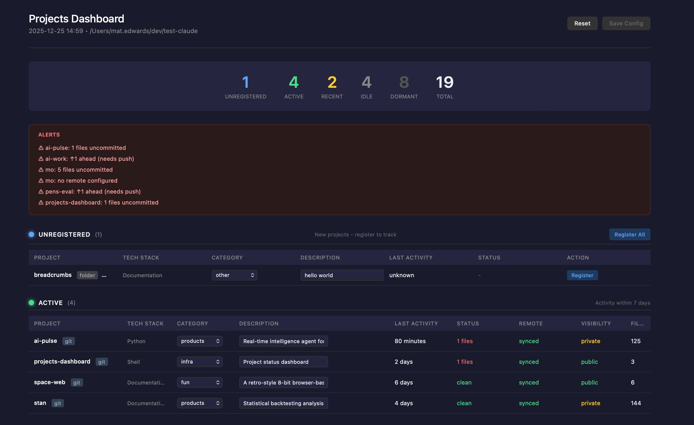

# Projects Dashboard

I'm working on a number of Claude projects simultaneously and keeping track of status was becoming a bit of an issue, so I created this dashboard to help track everything and keep me honest.

It's a bash script that generates an interactive HTML dashboard to track your coding projects. Works with git repositories and regular folders.



## What It Does

Scans a workspace directory, detects project types, and generates an HTML dashboard showing:
- Project activity status (active, recent, idle, dormant)
- Git status (uncommitted files, sync state)
- Auto-detected tech stack
- Custom categories and descriptions you assign

## Quick Start

```bash
# 1. Install dependencies
brew install jq          # macOS
sudo apt install jq      # Debian/Ubuntu
# curl is usually pre-installed; if not: brew install curl / sudo apt install curl

# 2. Clone and install
git clone https://github.com/mat-e-exp/projects-dashboard.git
cd projects-dashboard
./projects-dashboard.sh --install ~/your-projects-directory

# 3. Start a new Claude Code session - dashboard opens automatically
```

## Features

- **Auto-detection**: Scans filesystem, detects tech stacks (React, Python, Go, etc.)
- **Git integration**: Uncommitted files, remote sync status, last commit
- **Activity tracking**: Categorizes by days since last activity
- **Project registration**: Assign categories and descriptions to track projects
- **Alerts**: Warns about uncommitted changes, unpushed commits, missing remotes
- **Cross-platform**: macOS and Linux

## Requirements

- Bash 4.0+
- [jq](https://stedolan.github.io/jq/) for JSON parsing
- curl (for GitHub visibility checks)
- Git (optional, for repository features)

## Usage

```bash
# Run dashboard (uses configured workspace)
./projects-dashboard.sh

# Run for specific directory
./projects-dashboard.sh ~/projects

# Install as Claude Code session hook
./projects-dashboard.sh --install ~/workspace

# Remove hook
./projects-dashboard.sh --uninstall

# Show help
./projects-dashboard.sh --help
```

## Understanding the Dashboard

### Two Key Concepts

| Concept | What It Is | Editable? |
|---------|-----------|-----------|
| **Tech Stack** | Auto-detected from files (React, Python, etc.) | No - always auto-detected |
| **Category** | Project purpose you assign (products, infra, fun, etc.) | Yes - you choose |

### Activity Sections

Projects are grouped by how recently they were modified:

| Section | Days Since Last Activity |
|---------|--------------------------|
| Active | 0-7 days |
| Recent | 8-30 days |
| Idle | 31-90 days |
| Dormant | >90 days |

### Registered vs Unregistered

- **Unregistered**: New projects the dashboard found but you haven't categorized yet
- **Registered**: Projects you've assigned a category to - these are tracked in your config

## Registering Projects

When you first run the dashboard, all projects appear as "Unregistered". To organize them:

1. Find the project in the **Unregistered** section
2. Select a **Category** from the dropdown (products, infra, fun, etc.)
3. Optionally add a **Description**
4. Click **Register** (or **Register All** for bulk registration)
5. Click **Save Config** - downloads a config file to your Downloads folder
6. **Next dashboard run**: The config is automatically imported

The saved config persists your category and description choices.

## Config File

Project metadata is stored in `<workspace>/.projects-config.json`:

```json
{
  "my-project": {
    "category": "products",
    "description": "Frontend dashboard app"
  },
  "api-server": {
    "category": "infra",
    "description": "REST API backend"
  }
}
```

| Field | Purpose |
|-------|---------|
| `category` | Project purpose: `infra`, `products`, `fun`, `personal`, `skunkworks`, `other` |
| `description` | Your notes about the project (shown in dashboard) |

## Tech Stack Detection

The dashboard auto-detects project type from files:

| Detected As | Based On |
|-------------|----------|
| Next.js | `next.config.js` or `next.config.mjs` |
| Vite | `vite.config.js` or `vite.config.ts` |
| React | `react` in package.json |
| Vue | `vue` in package.json |
| Node.js | `package.json` (no framework detected) |
| Python | `requirements.txt`, `pyproject.toml`, or `setup.py` |
| Rust | `Cargo.toml` |
| Go | `go.mod` |
| Ruby | `Gemfile` |
| Java | `pom.xml` or `build.gradle` |
| Shell | `*.sh` files |
| Documentation | Only `README.md` or `CLAUDE.md` |

## Dashboard Columns

| Column | Git Repo | Regular Folder |
|--------|----------|----------------|
| Tech Stack | Auto-detected | Auto-detected |
| Category | From config | From config |
| Description | From config (or auto-filled) | From config (or auto-filled) |
| Last Activity | Time since last commit | Time since last file change |
| Status | Uncommitted file count | - |
| Remote | Sync status (ahead/behind/synced) | local-only |
| Visibility | public/private (GitHub repos) | local-only |
| Files | File count | File count |

Descriptions are auto-filled from `package.json`, `pyproject.toml`, or `README.md` if not set manually.

## Excluded Folders

These are automatically skipped during scans:

`node_modules`, `.git`, `.venv`, `venv`, `__pycache__`, `.cache`, `dist`, `build`, `.next`, `.nuxt`, `target`, `vendor`

## Installation Details

Running `--install` creates:

| File | Purpose |
|------|---------|
| `~/.config/projects-dashboard/config.json` | Stores workspace path and script location |
| `~/.claude/hooks/project-dashboard.sh` | Hook that runs on Claude Code session start |

To change your workspace later:
```bash
./projects-dashboard.sh --install ~/new-workspace
```

## Manual Claude Code Setup

If you prefer manual setup instead of `--install`, add to `~/.claude/settings.json`:

```json
{
  "hooks": {
    "SessionStart": [
      {
        "hooks": [
          {
            "type": "command",
            "command": "/path/to/projects-dashboard.sh /path/to/workspace"
          }
        ]
      }
    ]
  }
}
```

## Output

Generates `/tmp/projects-dashboard.html` and opens in your default browser.

## License

MIT
