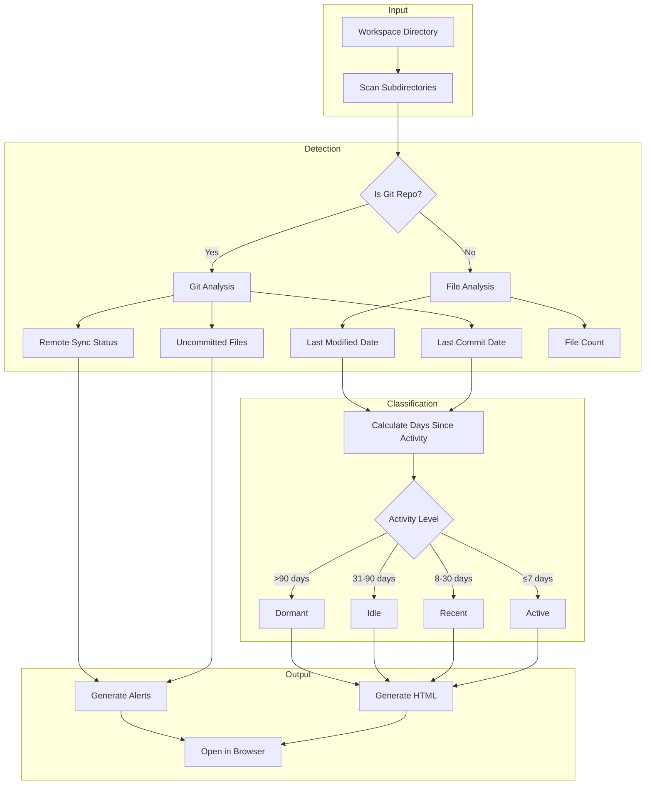

# Projects Dashboard

A simple bash script that generates an HTML dashboard to track your coding projects. Works with git repositories and regular folders.

## How It Works



## Features

- **Git repos**: Shows last commit, uncommitted files, remote sync status
- **Regular folders**: Shows last file modification, file count
- **Auto-detect project type**: Node.js, Python, React, Next.js, Rust, Go, Ruby, Java
- **Activity sections**: Active, Recent, Idle, Dormant
- **Alerts**: Uncommitted changes, unpushed commits, missing remotes
- **Cross-platform**: Works on macOS and Linux

## Installation

```bash
# Clone the repo
git clone https://github.com/yourusername/projects-dashboard.git

# Make executable
chmod +x projects-dashboard/projects-dashboard.sh

# Optional: Add to PATH
cp projects-dashboard/projects-dashboard.sh /usr/local/bin/projects-dashboard
```

## Usage

```bash
# Scan current directory
./projects-dashboard.sh

# Scan specific directory
./projects-dashboard.sh ~/projects

# Scan multiple workspaces (run separately)
./projects-dashboard.sh ~/work
./projects-dashboard.sh ~/personal
```

## Output

The script generates `/tmp/projects-dashboard.html` and opens it in your default browser.

| Column | Git Repo | Regular Folder |
|--------|----------|----------------|
| Last Activity | Last commit | Last file modified |
| Status | Uncommitted file count | - |
| Remote | Sync status (ahead/behind/synced) | - |
| Files | File count | File count |

## Project Type Detection

| Detected Type | Based On |
|---------------|----------|
| Next.js | `next.config.js` or `next.config.mjs` |
| Vite | `vite.config.js` or `vite.config.ts` |
| React | `react` in package.json |
| Vue | `vue` in package.json |
| Node.js | `package.json` |
| Python | `requirements.txt`, `pyproject.toml`, or `setup.py` |
| Rust | `Cargo.toml` |
| Go | `go.mod` |
| Ruby | `Gemfile` |
| Java | `pom.xml` or `build.gradle` |

## Excluded Folders

The following are automatically excluded from scans:

`node_modules`, `.git`, `.venv`, `venv`, `__pycache__`, `.cache`, `dist`, `build`, `.next`, `.nuxt`, `target`, `vendor`

## Using with Claude Code

Add as a session start hook in `~/.claude/settings.json`:

```json
{
  "hooks": {
    "SessionStart": [
      {
        "hooks": [
          {
            "type": "command",
            "command": "/path/to/projects-dashboard.sh ~/projects"
          }
        ]
      }
    ]
  }
}
```

## License

MIT
